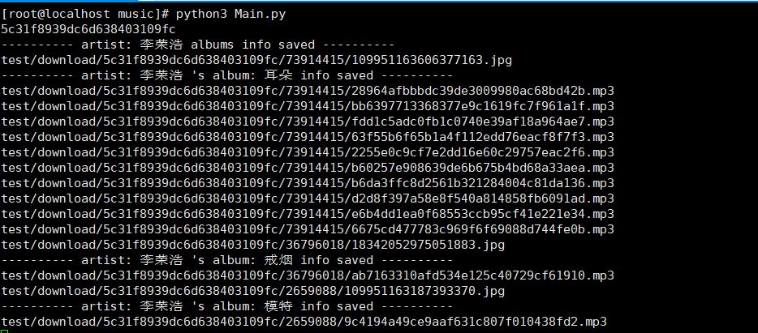

# MusicSpider

**网易云音乐接口的分析以及音乐获取（Music Spider to NetEase Music Based on Python）**

<p align="center">
    
    
    
    
    
</p>

> 作者本科毕业设计项目（数据爬虫部分），欢迎各位 star 或者 fork  
> 有任何问题可以提交 ISSUE 给我  
> 欢迎请我喝咖啡（详见底部）

### 项目说明

> 项目主要实现对网易云音乐接口的数据进行获取、分析以及持久化存储  
> 项目主要为本人本科毕业设计—— Infinity Music App，作数据保障  
> 项目请勿商用，如有需要，请联系：573459407@qq.com（同时由于是本人毕业设计，请不要 copy）

### 项目主要功能说明

- [X] 基于 AES 和 RSA 加密参数并获取网易云音乐 Json 数据
- [X] 实现获取网易云歌手相关专辑信息、专辑内音乐信息（包括专辑封面、音乐歌词等）
- [X] Json 数据的持久化存储（MongoDB）
- [X] 音乐、专辑封面的下载与存储（不包括下架、付费等）

### MongoDB 数据存储说明

- 数据存储为 json 格式，内容如下

```json
{
  "_id": "ObjectId()",
  "artist": {
    "name": "",
    "_id": 4292,
    "picUrl": ""
  },
  "albums": [
    {
      "name": "",
      "_id": 35457526,
      "size": 1,
      "picUrl": "",
      "publishTime": 1494007977282,
      "commentThreadId": "",
      "description": "",
      "tags": "",
      "company": "",
      "songs": [
        {
          "name": "",
          "_id": "",
          "mp3Url": "",
          "lyric": ""
        },
        {}
      ]
    }
  ],
  "albumCount": 20
}
```

### 项目运行说明

**clone项目**

> git clone https://github.com/anselleeyy/MusicSpider

**安装mongo**

> 参考：[CentOS 中安装 MongoDB 4](https://github.com/anselleeyy/MusicSpider/wiki/CentOS-%E4%B8%AD%E5%AE%89%E8%A3%85-MongoDB-4)

**修改相关配置**

- 修改 code 目录下的 Commons.py 中的
    - [DOWNLOAD_DIR]，歌曲以及专辑封面的下载地址，按需更改
    - [artists], 歌手列表，按需更改
    - [MONGO], MongoDB 配置信息，请按照自己本地环境修改
- 根据 [DOWNLOAD_DIR] 创建相应目录

**运行**

> 请运行根目录下的 Main.py  
> python Main.py

**运行结果如下（Windows10 和 Centos7 下运行均无问题）**

- 控制台



- MongoDB 数据库


### 请作者喝杯咖啡

<p align="center">
    
    
</p>
